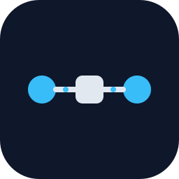

<div align="center">



# ai-fox

**面向 AI / LLM 的流量调试器**

把 Claude Code、Codex 这类 AI 工具的调用栈，做成一眼看穿的可视化细节。

<sub>Go · Huma · Electron · 端到端类型安全</sub>

</div>

---

## 它解决什么

你在用 Claude Code、Codex、或任何 OpenAI/Anthropic 兼容客户端，遇到这些场景：

- 想看真实的 prompt 长什么样，但 SDK 把它藏在五层之下
- 流式响应卡住了，不知道是网络、provider、还是工具自己的 bug
- tool call / MCP 调用链路一长，调试基本靠猜
- 想统计 token、看耗时、对比不同 provider 的实际行为

**ai-fox 把自己变成你和 AI provider 之间的网关**——客户端连 ai-fox，ai-fox 连上游。所有流量原样落盘、实时解析、可视化。

```
┌──────────────┐      ┌─────────┐      ┌────────────┐
│ Claude Code  │ ───► │ ai-fox  │ ───► │ Anthropic  │
│ Codex / ...  │ ◄─── │ (proxy) │ ◄─── │ OpenAI /…  │
└──────────────┘      └────┬────┘      └────────────┘
                           │
                           ▼
                  ┌─────────────────┐
                  │ 时间线 · prompt  │
                  │ headers · 流式  │
                  │ tool call · …   │
                  └─────────────────┘
```

## 特性

- **零侵入接入**：改一行 `baseURL` 指向 ai-fox，就接管全部流量
- **流式实时解析**：SSE 边收边切，逐 token / 逐 tool-call 展示，不等响应结束
- **完整时间线**：每条请求一行，点开看 headers、原始体、解析后的对话
- **解析层可扩展**：Anthropic Messages API 已支持，更多 provider 持续添加
- **本地优先**：监听仅 `127.0.0.1`，每次启动随机 token，apiKey 不离开你的机器

## 快速开始

需要 [Task](https://taskfile.dev)、Node ≥ 20、Go ≥ 1.22、pnpm。

```bash
# 拉依赖
pnpm install

# 开发模式（Electron + Go sidecar + 热重启）
task dev

# 提交前的硬门槛：typecheck + go test + lint
task verify

# 打可分发产物
task build       # Electron Forge: AppImage / Squirrel / ZIP
task build:arch  # Arch Linux pacman 包
```

## 架构

单桌面应用，业务逻辑全在 Go，Electron 只是带类型的前端：

```
Go struct ──► openapi.yaml ──► schema.ts ──► client.ts ──► renderer
   ▲                                                            │
   └────────────── HTTP (127.0.0.1, X-Ai-fox-Token) ────────────┘
```

新增端点的固定路径：

1. 在 `internal/api/` 写 struct + `huma.Register`
2. `task codegen` 让 TS 拿到新类型
3. 渲染进程用 `getClient()` 发请求

详细规则见 [`AGENTS.md`](./AGENTS.md)，常用导航见 [`CLAUDE.md`](./CLAUDE.md)。

## 目录结构

```
ai-fox/
├── main.go                      Go 入口；默认起 HTTP，openapi 子命令导 schema
├── internal/
│   ├── api/                     所有 HTTP 端点（必须经 huma.Register）
│   ├── server/                  listener + 鉴权中间件
│   ├── proxy/                   反向代理与流量记录
│   ├── llmparse/                provider 响应解析（Anthropic / …）
│   ├── store/                   流量持久化
│   └── config/                  上游配置
├── electron/
│   ├── src/main/                主进程：拉 sidecar、握手、热重启
│   ├── src/preload/             contextBridge 暴露 token
│   ├── src/renderer/            UI（vanilla TS + hyperscript）
│   └── src/api/                 openapi-fetch 客户端 + 生成的 schema
├── Taskfile.yml                 唯一编排入口
└── forge.config.ts              Electron Forge 打包配置
```

## 状态

早期开发中。反向代理与 Anthropic 流式解析已经能用，更多 provider、持久化加密、上游配置 UI 在路上。

## License

[Apache 2.0](./LICENSE)
